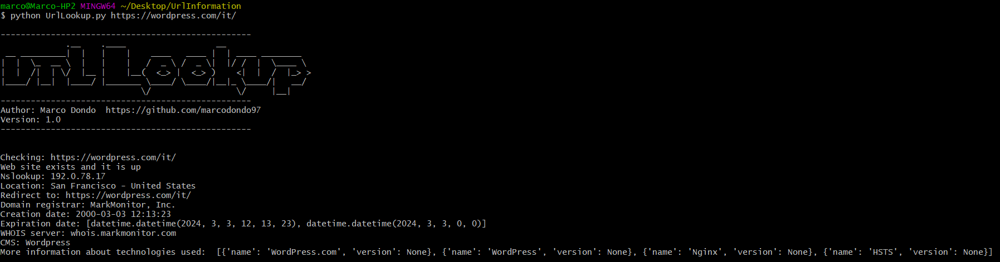

# Urllookup Python script
Python script to scan URL, get informtion about domain and website's technologies/languages.

## Description
This python script can be used for scan any URL and get the following infromation:<br>

- HTTP response
- Nslookup IP
- IP location
- Redirect destination
- Domain registrar 
- Domain creation and expiration date
- Domain manager
- CMS used
- Information about technologies/languages used

The URL/domain to scan has to be written inline in the CLI as the example below

## Getting Started

```
#example passing url/domain inline python 
python UrlLookup.py https://domain.com/path/

#Before starting make sure you install the following packages
pip install requests
pip install python-whois
pip install webtech

```
## Result


